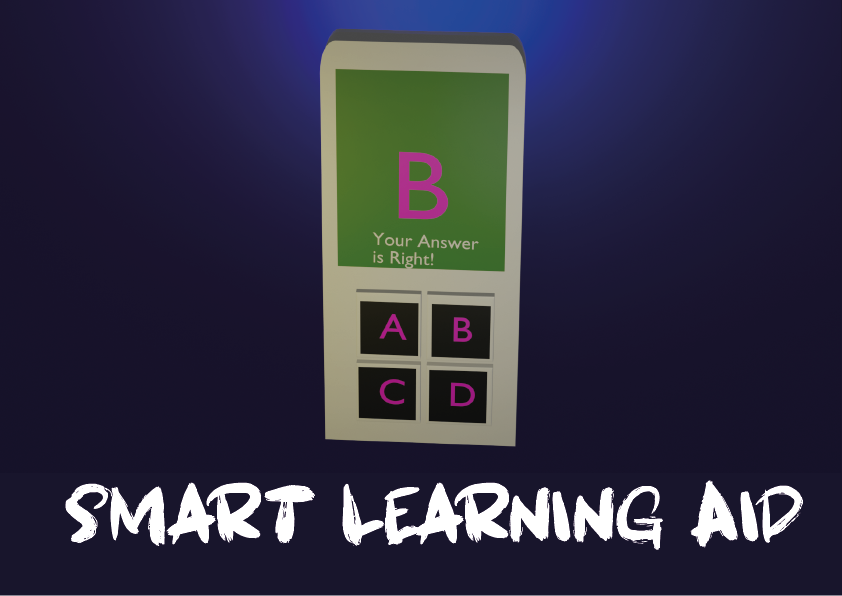

# Smart Learning Aid
## Prototype

Below is an image of the Smart Learning Aid prototype:



The **Smart Learning Aid** is an innovative solution designed to enhance classroom interaction by enabling learners to participate actively without the need for mobile phones. This system fosters a distraction-free learning environment while promoting engagement and collaboration.

## Features

- **Interactive Participation**: Students can respond to questions, polls, and quizzes using dedicated devices or interfaces.
- **Real-Time Feedback**: Teachers receive instant feedback to gauge understanding and adjust teaching strategies.
- **Distraction-Free Environment**: Eliminates the need for mobile phones, reducing distractions during class.
- **Customizable Content**: Supports various types of interactive content, including multiple-choice questions, open-ended responses, and more.
- **Seamless Integration**: Easily integrates with existing classroom technologies and learning management systems.

## Benefits

- Encourages active participation and engagement.
- Reduces reliance on personal devices, promoting focus.
- Provides valuable insights into student performance.
- Enhances the overall learning experience.

## How It Works

1. **Setup**: Install the Smart Learning Aid system in the classroom.
2. **Interaction**: Teachers create interactive content, and students respond using the provided interface.
3. **Feedback**: Responses are collected and analyzed in real-time, enabling immediate insights.


## Use Cases

- Classroom quizzes and assessments.
- Real-time polling during lectures.
- Interactive discussions and brainstorming sessions.

## Hardware Used

- 2 ESP32S2 boards - aacted as the slaves (code in student1.c++ & student2.c++)
- Arduino nano board which acted as the master
- buttons
- SSD1306 0.96" OLED display
- Rechargable batteries (I used 2(3.7v) batteries)
  
## Getting Started

1. Clone the repository:
    ```bash
    git clone https://github.com/charlesricha/Smart-learning-aid.git
    ```
2. Follow the installation instructions in the [documentation](docs/installation.md).
3. Start creating interactive content and engage your learners!

## Contributing

We welcome contributions! Please read our [contributing guidelines](CONTRIBUTING.md) to get started.

## License

This project is licensed under the [MIT License](LICENSE).

## Contact

For questions or support, please contact us at .
